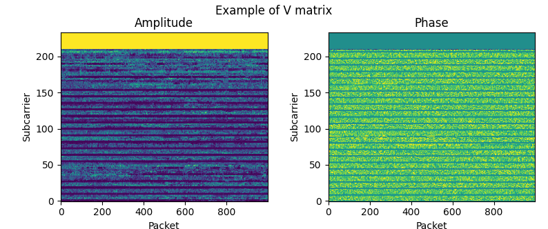

<p align='center'>

</p>

# WiPiCap: Wi-Fi Compressed Beamforming Report Decoding System
This project gives useful scripts and documents to help researchers who try to implement wireless sensing system with IEEE 802.11 ac/ax Compressed Beamforming Report.

# 🎉 Latest Update (08/07/2025)
C++ implementation is released!  Much faster than Python version, fast enough for real-time stream decoding and visualization.

## Motivation

In recent years, numerous researchers have been actively pursuing the development of robust wireless sensing systems that can be seamlessly integrated with widely deployed Wi-Fi networks. Many of these researchers have opted to utilize 802.11n CSI Tools (https://dhalperi.github.io/linux-80211n-csitool/) or Atheros CSI Tool (https://wands.sg/research/wifi/AtherosCSI/) to obtain raw CSI data. However, these tools necessitate the use of specific network interface cards, resulting in a significant technological cost. Furthermore, the majority of contemporary Wi-Fi chips incorporated in major laptops lack the capability to transmit raw CSI data to the access point.

In contrast, many devices conforming to modern standards, **802.11ac/ax**, transmit VHT Compressed Beamforming Report (CBR) back to access points. This signal is a mathematical transformation of the original channel matrix. We presume this signal conveys channel status, enabling its utilization for wireless sensing. VHT CBR can be acquired through standard packet capture. Notably, there are no limitations or requirements regarding the Wi-Fi chipset because CBR is protocol-compliant feedback. For further details on the mathematical transformation from CSI into CBR, please refer to the appendix (which will be available shortly).

If you are interested in our idea to use this information for wireless sensing, please check our previous works:  
- CSI2Image: Image Reconstruction From Channel State Information Using Generative Adversarial Networks (https://ieeexplore.ieee.org/document/9380376)
- CBR-ACE: Counting Human Exercise using Wi-Fi Beamforming Reports (https://www.jstage.jst.go.jp/article/ipsjjip/30/0/30_66/_article/-char/ja/)

---
## Usage
### Python
> [!NOTE]
> Real-time stream decoding and live plotting are not available with Python module.

```python
from wipicap import get_v_matrix

v_matrix = get_v_matrix(pcap_file='./test.pcap', address='11:22:33:44:55:66', bw=80)
# v_matrix is a complex-valued ndarray with the shape of (packets, subcarriers, rx, tx)
```



### C++
Real-time stream decoding and live plot with the following command:  
`./wipicap [wireless interface name] [MAC address]`

Before running the program, make sure that the system activates a wireless network interface in monitor mode (e.g. mon0).  The easiest way to create such an interface is to use aircrack-ng (https://github.com/aircrack-ng/aircrack-ng).

---

## Setup
### Python
1. Install dependencies. `pip install -r requirements.txt`
2. Build the package. `python setup.py build_ext --inplace`

### C++
We recommend to compile the source on Ubuntu/Raspberry Pi OS.
#### Dependencies
- libpcap
  - `sudo apt install libpcap-dev`
- eigen
  - `sudo apt install libeigen3-dev`
- matplotlibcpp
  - Put matplotlibcpp.h (https://github.com/lava/matplotlib-cpp) in ./C++.
- Python with development headers
  `sudo apt install python3-matplotlib python3-numpy python3-dev`

1. Compile mobicom25_demo.cpp
   ```bash
   g++ -std=c++17 -O2 \
   -I/usr/include/eigen3 \
   -I/usr/include/python3.12 \
   -I/usr/include/x86_64-linux-gnu/python3.12 \
   -I/usr/lib/python3/dist-packages/numpy/core/include \
   mobicom25_demo.cpp \
   -lpcap -lpython3.12 \
   -o wipicap
   ```
   Confirm Python version is matched with the one installed in your system.
---

## Misc.
### Packet Capture on Raspberry Pi
Please check Nexmon firmware patch (https://github.com/seemoo-lab/nexmon) to build your own testbed using Raspberry Pi 3B+/4.

### FAQ
N/A

---

## Changelog
- 12/06/2024
  - Universal support for both IEEE 802.11ac VHT and 802.11ax HE beamforming report extraction.

## Citation
If you use WiPiCap in your work, please consider citing the following paper:
```
@ARTICLE{cbrace,
  title   = "{CBR-ACE}: Counting Human Exercise using {Wi-Fi} Beamforming
             Reports",
  author  = "Sorachi Kato and Tomoki Murakami and Takuya Fujihashi and
             Takashi Watanabe and Shunsuke Saruwatari",
  journal = "Journal of Information Processing",
  volume  =  30,
  pages   = "66--74",
  year    =  2022
}
```

# Who cites our works
1. F. Tian, Y. Jiang, C. Bao, B. Peng, F. Hong, and Z. Guo, “CBR-HAR: Real-time human activity recognition based on CBR,” IEEE Wirel. Commun. Lett., vol. 14, no. 7, pp. 2179–2183, Jul. 2025.
1. R. Xiao, X. Chen, Y. He, J. Han, and J. Han, “Lend me your beam: Privacy implications of plaintext beamforming feedback in WiFi,” Netw Distrib Syst Secur Symp, 2025.
1. E. Yi et al., “BFMSense: WiFi Sensing Using Beamforming Feedback Matrix,” NSDI, pp. 1697–1712, 2024.
1. A. Liu, Y.-T. Lin, and K. Sundaresan, “View-agnostic human exercise cataloging with single MmWave radar,” Proc. ACM Interact. Mob. Wearable Ubiquitous Technol., vol. 8, no. 3, pp. 1–23, Aug. 2024.
1. E. Yi, F. Zhang, J. Xiong, K. Niu, Z. Yao, and D. Zhang, “Enabling WiFi sensing on new-generation WiFi cards,” Proc. ACM Interact. Mob. Wearable Ubiquitous Technol., vol. 7, no. 4, pp. 1–26, Dec. 2023.
1. C. Wu, X. Huang, J. Huang, and G. Xing, “Enabling ubiquitous WiFi sensing with beamforming reports,” in Proceedings of the ACM SIGCOMM 2023 Conference, New York NY USA, 2023.
1. E. Yi, F. Zhang, J. Xiong, K. Niu, Z. Yao, and D. Zhang, “Enabling WiFi sensing on new-generation WiFi cards,” Proc. ACM Interact. Mob. Wearable Ubiquitous Technol., vol. 7, no. 4, pp. 1–26, Dec. 2023.

# Author
S. Kato

Graduate School of Information Science and Technology, Osaka University

